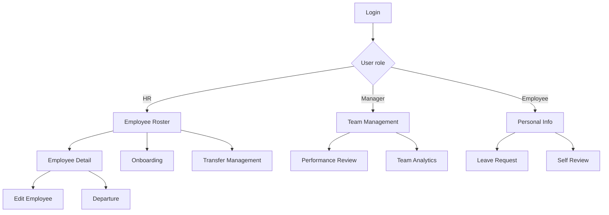

# Employee Management PRD (English)

> [中文](员工管理PRD.md) | English

## 1. Product Overview
An employee full-lifecycle management system built on the Dog Framework, integrating organization structure, HR profiles and transfer management. It provides HR, managers and employees with role-specific HR management solutions to improve enterprise HR efficiency.

It follows the framework's Symfony + Twig stack, reusing existing UI libraries and components for rapid development and a consistent user experience.

## 2. Core Features

### 2.1 User Roles
| Role | Registration | Core Permissions |
|------|-------------|------------------|
| HR Admin | Created during system init | Global employee profile management, org structure maintenance, HR process approval |
| Department Manager | HR authorization or auto-detection | Team member management, performance review, leave approval |
| Regular Employee | Auto-created via onboarding | Personal info maintenance, leave requests, team view, self-review |
| System Admin | Created during system init | Account security, role/permission config, system settings |

### 2.2 Feature Modules
The employee management system includes the following core pages:

1. **Employee Roster**: org-structure navigation, employee list, advanced search, bulk actions
2. **Employee Detail**: personal info, position info, contract info, education, work history
3. **Onboarding**: step-by-step onboarding flow, info collection, account creation, welcome email
4. **Transfer Management**: regularization, transfer, departure, rehire workflow
5. **Team Management**: my team, performance overview, people analytics, headcount management
6. **HR Reports**: headcount structure analysis, turnover statistics, cost analysis

### 2.3 Page Details

| Page | Module | Description |
|------|--------|-------------|
| Employee Roster | Org tree | Shows group-company-department hierarchy; search, expand/collapse, click to refresh employee list |
| Employee Roster | Search/filter | Fuzzy search by name/employee no./phone, status filter, join date range, multi-department select, Excel export |
| Employee Roster | Employee list | No., name, avatar, department, position, level, status, join date, phone, actions |
| Employee Roster | Bulk actions | Bulk import, bulk transfer, bulk departure, bulk export, custom columns |
| Employee Detail | Basic info | Avatar, no., name, gender, DOB, ID, contacts, address |
| Employee Detail | Position info | Company, department, position, level, reporting, type, status, join/regularized/departure dates |
| Employee Detail | Contract info | Contract entity, type, signing date, expiry date, renewal reminder |
| Employee Detail | Education | School, major, degree, diploma, dates, full-time flag |
| Employee Detail | Work history | Company, department, position, dates, description, reference |
| Onboarding | Wizard | Step-by-step: basic → position → contract → education → account → done |
| Onboarding | Validation | Unique employee no., phone format, ID validity, email domain check |
| Onboarding | Account linkage | Choose whether to create a system account; auto-generate initial password; send welcome email |
| Transfer | Regularization | Select probationary employee, evaluation, date, salary adjustment, approval flow |
| Transfer | Transfer | Select employee, from/to department, position, level, reason, effective date |
| Transfer | Departure | Select employee, type, reason, date, handover, disable account |
| Transfer | Rehire | Select former employee, restore or assign position, reactivate account |
| Team | Overview | My direct team, headcount, actual count, probation count, upcoming departures |
| Team | Analytics | Age distribution, education, tenure, gender ratio, level distribution charts |
| Team | Performance | Team member scores, ranking, trend, pending review reminders |
| Team | Headcount | Department headcount config, over/under staffing analysis, hiring demand forecast |
| Reports | Structure | Headcount structure charts by department, level, age, education, tenure |
| Reports | Turnover | Hire rate, departure rate, turnover trend, departure reason analysis |
| Reports | Cost | Labor cost composition, department comparison, per-capita cost trend |

## 3. Core Flows

### HR Management Flow
HR login → employee roster → select department → view employees → onboarding → fill info → create profile → send welcome email → employee check-in → probation → regularization review → transfer → departure → archive

### Employee Self-Service Flow
Employee login → view personal info → update contacts → submit leave → view pay slip → self-review → view team announcements → departure handover

### Manager Flow
Manager login → my team → approve subordinate requests → performance review → team analytics → headcount planning → hiring decisions

## 4. User Interface Design

### 4.1 Design Standards
- **Tech stack**: Symfony + Twig, pages rendered via Twig templates
- **UI components**: reuse components in `/templates/ui/` (tables, trees, modals)
- **Styling**: use existing framework CSS classes, Bootstrap-like naming
- **Icons**: unified FontAwesome free icons for visual consistency
- **Interactions**: jQuery + the framework's ajax library for async behavior

### 4.2 Page Design
| Page | Module | UI Elements |
|------|--------|-------------|
| Roster | Org tree | 200px fixed left, indented tree, blue selection highlight, gray hover |
| Roster | Search | Top toolbar, 4px rounded inputs, blue primary search button, filter dropdowns |
| Roster | Data grid | Zebra rows, fixed header, fixed action column, centered bottom pagination |
| Detail | Info cards | Split card layout, white background, shadow, blue-bordered titles, two-column content |
| Onboarding | Steps | Top step indicator, blue current, green done with checkmark, gray pending |
| Onboarding | Form | Right-aligned labels, uniform inputs, red asterisk for required, red error text |
| Team | Charts | Pie for structure, bar for age, line for trends |
| Reports | Filter panel | Top time-range picker, multi-department dropdown, export button top-right |

### 4.3 Responsive Design
- **Desktop-first**: optimized for 1920×1080 and 1366×768
- **Tablet**: full layout above 768px; below, left nav collapses to hamburger
- **Mobile**: core features only; grids become card lists
- **Touch**: min 44px touch targets, gesture swipe support

## 5. Static Page Plan

Based on the feature design, 5 static page implementations are proposed:

### Option A: Employee Roster List (Recommended)
**Priority: High**
- Left-tree right-table layout with org navigation and employee list
- Full search/filter with multi-condition combination
- Complete bulk action buttons; core employee info in the grid
- Uses the framework's DataGrid component; lowest development cost

### Option B: Employee Detail Page
**Priority: High**
- Side-drawer form showing full employee info in sections
- Basic info, position, contract, education, work history
- Edit entry and complete action buttons
- Clear info structure for quick viewing and comparison

### Option C: Onboarding Wizard
**Priority: Medium**
- Step-by-step onboarding with top progress indicator
- Clear form groups; draft saving
- Real-time validation and error hints
- Linked account creation; automatic welcome email

### Option D: Team Management Dashboard
**Priority: Medium**
- Manager-view team overview page
- People structure analysis charts, data visualization
- Headcount management and over/under staffing analysis
- Performance overview and pending reminders

### Option E: Transfer Management Flow
**Priority: Low**
- Regularization, transfer, departure, rehire workflows
- Form filling and approval flow
- History viewing and tracking
- Bulk processing support

**Suggested implementation order**: A → B → C → D → E

**Technical notes**:
1. Reuse tree, grid and form components in `/templates/ui/`
2. Use FontAwesome icons; avoid custom icons
3. Follow framework CSS naming; use existing style classes
4. Use the framework's ajax library (`/public/lib/ef/base/ajax.js`) for async
5. Use the framework's ApiResponse class for JSON responses
6. Support responsive layouts for different screen sizes
7. Provide complete interaction logic and validation rules
