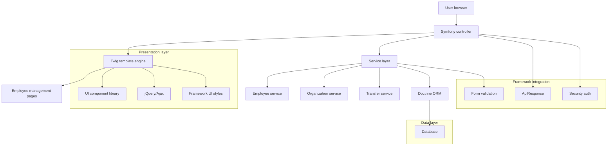

# Employee Management Technical Architecture (English)

> [中文](员工管理技术架构.md) | English

## 1. Architecture

## 2. Technology Stack

- **Backend framework**: Symfony (PHP)
- **Template engine**: Twig
- **Frontend**: jQuery + framework UI styles
- **UI components**: framework custom components (`/templates/ui/`)
- **HTTP communication**: framework ajax library (`/public/lib/ef/base/ajax.js`)
- **Data persistence**: Doctrine ORM
- **Form handling**: Symfony Form + custom FormType
- **Validation**: Symfony Validator + custom rules
- **Security**: Symfony Security component
- **API responses**: framework ApiResponse class (`/src/Controller/Api/ApiResponse.php`)
- **Third-party**: Font Awesome (icons)
- **Styles & components**:
  - Grid & layout: `/public/sunui/ui/grid.css`, `/public/sunui/ui/layout.css`
  - Tree component: `/templates/ui/tree.html.twig`, `public/sunui/components/tree.css`
  - Table component: `/templates/ui/table.html.twig`, `public/sunui/components/datagrid.css`

## 3. Routing

| Route | Controller method | Template | Description |
|-------|-------------------|----------|-------------|
| /employee | EmployeeController::index() | employee/index.html.twig | Employee roster home |
| /employee/list | EmployeeController::list() | employee/list.html.twig | Employee list (Ajax) |
| /employee/{id} | EmployeeController::show() | employee/show.html.twig | Employee detail |
| /employee/new | EmployeeController::new() | employee/new.html.twig | Onboarding page |
| /employee/{id}/edit | EmployeeController::edit() | employee/edit.html.twig | Edit employee |
| /employee/transfer | EmployeeController::transfer() | employee/transfer.html.twig | Transfer management |
| /api/employee/search | ApiEmployeeController::search() | JSON | Employee search API |

## 4. Data Model

- **Employee**: personal + position + contract + education + work history
- **Department**: tree structure under companies
- **Position / PositionLevel**: job catalog with salary ranges
- **Company / Corporation**: top-level org entities

## 5. Key Services

- **EmployeeService**: employee CRUD, roster search, onboarding, transfer
- **OrganizationService**: org tree, department management
- **TransferService**: regularization, transfer, departure, rehire workflows

## 6. API Conventions

- JSON via the framework `ApiResponse` class (`code` = translation key, `message` = fallback)
- Frontend uses `window.apiMsg(xhr)` to resolve localized error messages

## 7. Internationalization

- UI text uses Twig `{{ 'key'|trans }}` / JS `t('key')`; keys live in `translations/messages.{locale}.yaml`
- Email templates are multi-language via `sys_email_template.locale`
- See `documents/i18n-guide.md` for the full conventions
